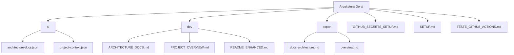
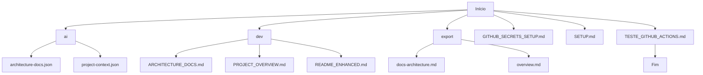
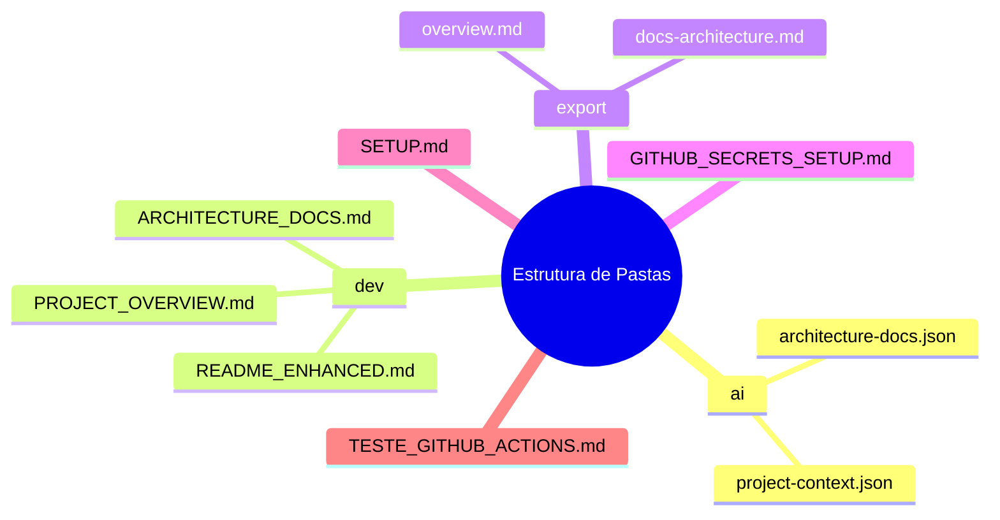

```markdown
# Architecture Documentation - docs

**Generated:** 2025-08-11T16:28:30.360Z  
**Project:** docs  
**Type:** Documentation  

## Project Structure

```
├── ai (2 files)
│   ├── architecture-docs.json
│   └── project-context.json
├── dev (3 files)
│   ├── ARCHITECTURE_DOCS.md
│   ├── PROJECT_OVERVIEW.md
│   └── README_ENHANCED.md
├── export (2 files)
│   ├── docs-architecture.md
│   └── overview.md
├── GITHUB_SECRETS_SETUP.md
├── SETUP.md
└── TESTE_GITHUB_ACTIONS.md
```

## Dependencies
- **N/A**: Atualmente, não há dependências críticas documentadas. Recomenda-se revisar periodicamente para garantir que todas as dependências sejam registradas.

## Folder Structure Analysis

### `ai`
- **Purpose:** Armazenar arquivos de configuração essenciais para a arquitetura do projeto.
- **Files:** 2
  - `architecture-docs.json`: Contém dados estruturais da arquitetura.
  - `project-context.json`: Define o contexto do projeto e suas interações.

### `dev`
- **Purpose:** Documentação técnica e guias para desenvolvedores.
- **Files:** 3
  - `ARCHITECTURE_DOCS.md`: Documentação detalhada sobre a arquitetura do sistema.
  - `PROJECT_OVERVIEW.md`: Visão geral do projeto, incluindo objetivos e escopo.
  - `README_ENHANCED.md`: Instruções e informações adicionais para desenvolvedores.

### `export`
- **Purpose:** Documentação exportável para stakeholders e usuários finais.
- **Files:** 2
  - `docs-architecture.md`: Descrição da arquitetura em um formato acessível.
  - `overview.md`: Resumo do projeto e suas funcionalidades.

### Outros Arquivos
- `GITHUB_SECRETS_SETUP.md`: Instruções para configuração de segredos no GitHub.
- `SETUP.md`: Guia de configuração do ambiente de desenvolvimento.
- `TESTE_GITHUB_ACTIONS.md`: Testes e exemplos de ações do GitHub.

---

## Dados da Arquitetura
```json
{
  "folders": {
    "ai": {
      "type": "directory",
      "children": {
        "architecture-docs.json": {
          "type": "file",
          "extension": ".json",
          "size": 2510,
          "purpose": "Configuration/data file"
        },
        "project-context.json": {
          "type": "file",
          "extension": ".json",
          "size": 629,
          "purpose": "Configuration/data file"
        }
      },
      "fileCount": 2,
      "purpose": "Configuration files"
    },
    "dev": {
      "type": "directory",
      "children": {
        "ARCHITECTURE_DOCS.md": {
          "type": "file",
          "extension": ".md",
          "size": 6746,
          "purpose": "Documentation file"
        },
        "PROJECT_OVERVIEW.md": {
          "type": "file",
          "extension": ".md",
          "size": 1837,
          "purpose": "Documentation file"
        },
        "README_ENHANCED.md": {
          "type": "file",
          "extension": ".md",
          "size": 2276,
          "purpose": "Documentation file"
        }
      },
      "fileCount": 3,
      "purpose": "Documentation"
    },
    "export": {
      "type": "directory",
      "children": {
        "docs-architecture.md": {
          "type": "file",
          "extension": ".md",
          "size": 238,
          "purpose": "Documentation file"
        },
        "overview.md": {
          "type": "file",
          "extension": ".md",
          "size": 174,
          "purpose": "Documentation file"
        }
      },
      "fileCount": 2,
      "purpose": "Documentation"
    },
    "GITHUB_SECRETS_SETUP.md": {
      "type": "file",
      "extension": ".md",
      "size": 2878,
      "purpose": "Documentation file"
    },
    "SETUP.md": {
      "type": "file",
      "extension": ".md",
      "size": 4810,
      "purpose": "Documentation file"
    },
    "TESTE_GITHUB_ACTIONS.md": {
      "type": "file",
      "extension": ".md",
      "size": 1837,
      "purpose": "Documentation file"
    }
  },
  "dependencies": [],
  "patterns": [],
  "technologies": []
}
```

## Instruções

1. **Padrões Arquiteturais**: 
   - O projeto segue um padrão de separação de preocupações, onde a configuração e a documentação são mantidas em diretórios distintos, facilitando a manutenção e a escalabilidade.

2. **Fluxo de Dados**: 
   - Os dados fluem entre os arquivos de configuração (`ai`) e a documentação (`dev` e `export`), permitindo que as informações sobre a arquitetura sejam facilmente acessadas e compreendidas por desenvolvedores e stakeholders.

3. **Decisões de Design**: 
   - A escolha de arquivos JSON para configuração permite uma estrutura de dados flexível e facilmente manipulável. A documentação em Markdown garante legibilidade e acessibilidade.

4. **Diagramas**: 
   - Abaixo está um diagrama representando a arquitetura do projeto em formato Mermaid:

   ```mermaid
   graph TD;
       A[ai] -->|Configuração| B[dev];
       B -->|Documentação| C[export];
       D[GITHUB_SECRETS_SETUP.md] --> B;
       E[SETUP.md] --> B;
       F[TESTE_GITHUB_ACTIONS.md] --> B;
   ```

5. **Estrutura de Pastas e Convenções**: 
   - A estrutura de pastas é organizada por tipo de conteúdo (configuração, documentação), seguindo convenções de nomenclatura em letras maiúsculas para arquivos principais e minúsculas para arquivos auxiliares.

6. **Dependências Críticas**: 
   - Atualmente, não existem dependências críticas documentadas. É recomendável que qualquer nova dependência seja registrada assim que identificada.

7. **Performance**: 
   - A performance do sistema deve ser monitorada regularmente, especialmente em relação ao tempo de carregamento dos arquivos de configuração e à eficiência na geração de documentação.

8. **Pontos de Extensão**: 
   - O sistema é projetado para ser extensível, permitindo a adição de novos arquivos de configuração e documentação conforme necessário, sem comprometer a estrutura existente.

---
*Generated automatically by Documentation Generator*
```
## Diagrams






