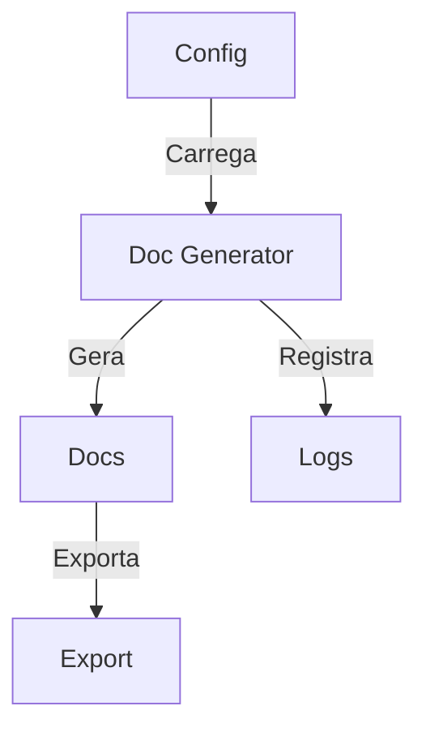
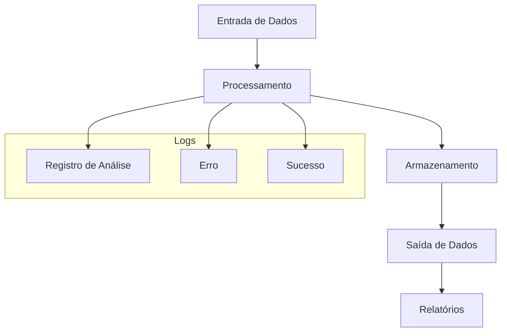
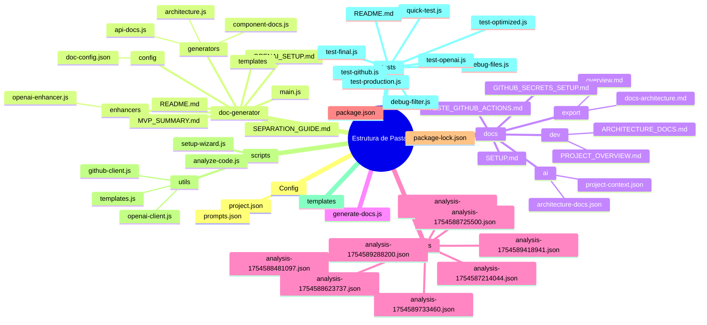

```markdown
# Architecture Documentation - Automation

**Generated:** 2025-08-11T14:03:43.513Z  
**Project:** Automation  
**Type:** Automation  

## Project Structure

```
├── config (2 files)
│   ├── project.json
│   └── prompts.json
├── doc-generator (11 files)
│   ├── config (1 file)
│   │   └── doc-config.json
│   ├── enhancers (1 file)
│   │   └── openai-enhancer.js
│   ├── generators (3 files)
│   │   ├── api-docs.js
│   │   ├── architecture.js
│   │   └── component-docs.js
│   ├── main.js
│   ├── MVP_SUMMARY.md
│   ├── OPENAI_SETUP.md
│   ├── README.md
│   ├── SEPARATION_GUIDE.md
│   └── templates (1 file)
├── docs (9 files)
│   ├── ai (2 files)
│   │   ├── architecture-docs.json
│   │   └── project-context.json
│   ├── dev (2 files)
│   │   ├── ARCHITECTURE_DOCS.md
│   │   └── PROJECT_OVERVIEW.md
│   ├── export (2 files)
│   │   ├── docs-architecture.md
│   │   └── overview.md
│   ├── GITHUB_SECRETS_SETUP.md
│   ├── SETUP.md
│   └── TESTE_GITHUB_ACTIONS.md
├── generate-docs.js
├── logs (8 files)
│   ├── analysis-1754587214044.json
│   ├── analysis-1754588481097.json
│   ├── analysis-1754588623737.json
│   ├── analysis-1754588675125.json
│   ├── analysis-1754588725500.json
│   ├── analysis-1754589288200.json
│   ├── analysis-1754589418941.json
│   └── analysis-1754589733460.json
├── package-lock.json
├── package.json
├── README-TESTS.md
├── README.md
├── scripts (5 files)
│   ├── analyze-code.js
│   ├── setup-wizard.js
│   └── utils (3 files)
│       ├── github-client.js
│       ├── openai-client.js
│       └── templates.js
├── templates (0 files)
├── test-openai.js
├── test-performance.js
├── test-quick.js
├── test-system.js
└── tests (9 files)
    ├── debug-files.js
    ├── debug-filter.js
    ├── quick-test.js
    ├── README.md
    ├── test-final.js
    ├── test-github.js
    ├── test-openai.js
    ├── test-optimized.js
    └── test-production.js
```

## Dependencies

### Other
- `@octokit/rest` (^20.0.2) - Biblioteca para interagir com a API do GitHub.
- `dotenv` (^17.2.1) - Carrega variáveis de ambiente de um arquivo `.env`.
- `openai` (^4.0.0) - Cliente para interagir com a API da OpenAI.
- `eslint` (^8.0.0) - Ferramenta para análise de código JavaScript.
- `prettier` (^3.0.0) - Formatador de código para garantir consistência.

## Folder Structure Analysis

### `config`
**Purpose:** Contém arquivos de configuração essenciais para o projeto.  
**Files:** 2

### `doc-generator`
**Purpose:** Diretório responsável pela geração de documentação.  
**Files:** 11

#### `doc-generator/config`
**Purpose:** Arquivos de configuração para o gerador de documentação.  
**Files:** 1

#### `doc-generator/enhancers`
**Purpose:** Scripts que melhoram a qualidade da documentação gerada.  
**Files:** 1

#### `doc-generator/generators`
**Purpose:** Scripts que geram diferentes tipos de documentação.  
**Files:** 3

#### `doc-generator/templates`
**Purpose:** Diretório para armazenar templates de documentação.  
**Files:** 1

### `docs`
**Purpose:** Contém a documentação do projeto.  
**Files:** 9

### `logs`
**Purpose:** Armazena logs de análises realizadas pelo sistema.  
**Files:** 8

### `scripts`
**Purpose:** Scripts utilitários e de construção.  
**Files:** 5

### `tests`
**Purpose:** Contém arquivos de teste para garantir a qualidade do código.  
**Files:** 9

## Architectural Patterns

O projeto utiliza padrões de arquitetura modular, permitindo a separação de responsabilidades entre diferentes componentes. Cada diretório é responsável por uma parte específica da funcionalidade do sistema, o que facilita a manutenção e a escalabilidade.

## Data Flow Between Components

1. **Entrada de Dados:** Os dados são recebidos através de arquivos de configuração (`config/project.json` e `config/prompts.json`).
2. **Processamento:** O `doc-generator` processa esses dados utilizando scripts localizados em `doc-generator/generators`.
3. **Geração de Documentação:** A documentação é gerada e armazenada na pasta `docs`, onde pode ser acessada e exportada conforme necessário.
4. **Logs:** O sistema registra todas as operações em arquivos de log na pasta `logs`, permitindo auditoria e análise posterior.

## Design Decisions

- **Modularidade:** A estrutura do projeto foi organizada de forma modular para facilitar a colaboração entre equipes e a manutenção do código.
- **Uso de JSON:** A escolha do formato JSON para arquivos de configuração permite fácil leitura e manipulação.
- **Integração com APIs:** A integração com a API da OpenAI e do GitHub foi projetada para ser simples e direta, utilizando bibliotecas bem estabelecidas.

## Diagrama de Arquitetura



## Performance Considerations

- **Análise de Desempenho:** Scripts de teste (`test-performance.js`) são utilizados para medir a eficiência do sistema.
- **Otimização:** O código é revisado regularmente para garantir que as melhores práticas de desempenho sejam seguidas, utilizando ferramentas como ESLint e Prettier.

## Extension Points

- **Plugins:** O sistema permite a adição de novos geradores de documentação através da extensão do diretório `doc-generator/generators`.
- **Customização:** Os usuários podem modificar os arquivos de configuração em `config` para adaptar o comportamento do gerador de documentação às suas necessidades específicas.

---
*Generated automatically by Documentation Generator*
```
## Diagrams

```mermaid
graph TD
    A[Arquitetura Geral] -->|Contém| B[Configurações]
    A -->|Contém| C[Documentação]
    A -->|Contém| D[Scripts]
    A -->|Contém| E[Testes]
    A -->|Contém| F[Logs]
    A -->|Contém| G[Pacotes]
    A -->|Contém| H[Templates]
    
    B -->|Contém| B1[project.json]
    B -->|Contém| B2[prompts.json]
    B -->|Contém| B3[package.json]
    B -->|Contém| B4[package-lock.json]

    C -->|Contém| C1[README.md]
    C -->|Contém| C2[MVP_SUMMARY.md]
    C -->|Contém| C3[OPENAI_SETUP.md]
    C -->|Contém| C4[SEPARATION_GUIDE.md]
    C -->|Contém| C5[docs]
    C -->|Contém| C6[doc-generator]

    D -->|Contém| D1[analyze-code.js]
    D -->|Contém| D2[setup-wizard.js]
    D -->|Contém| D3[utils]

    E -->|Contém| E1[test-openai.js]
    E -->|Contém| E2[test-performance.js]
    E -->|Contém| E3[test-quick.js]
    E -->|Contém| E4[test-system.js]
    E -->|Contém| E5[tests]

    F -->|Contém| F1[logs]
```






