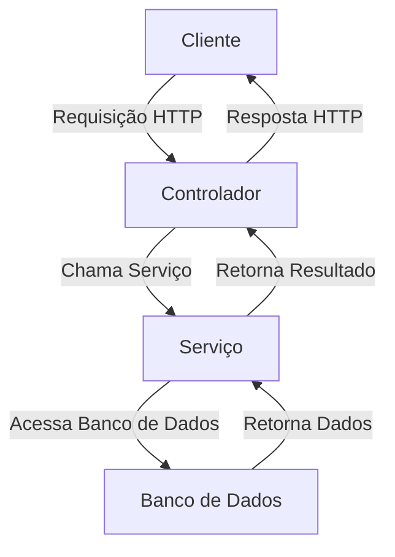
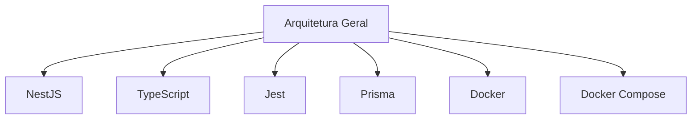
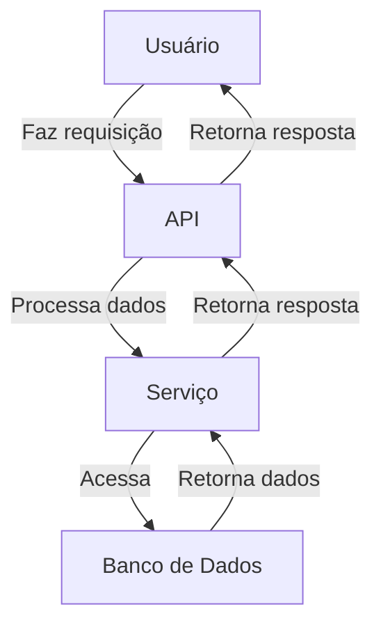
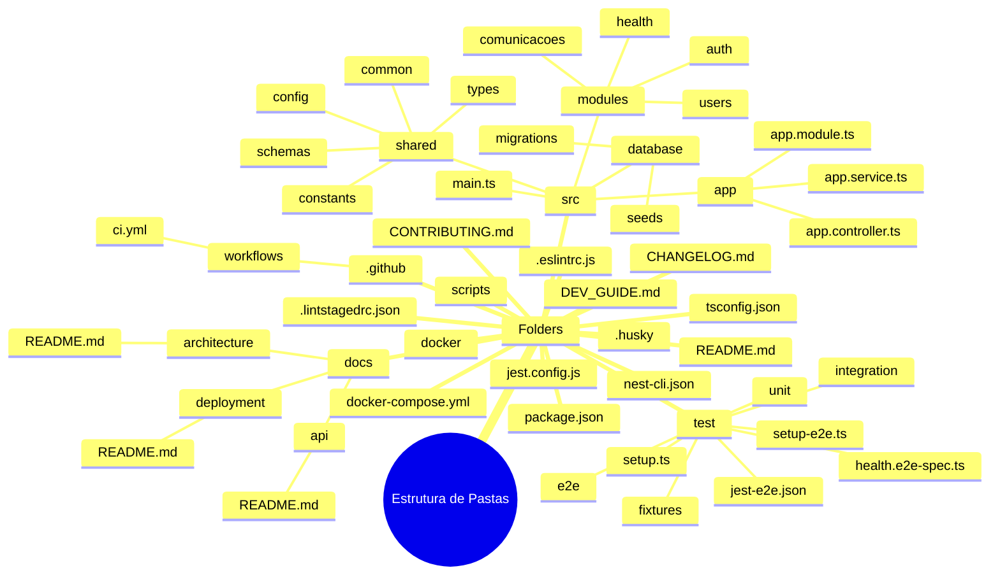

```markdown
# Documentação de Arquitetura - Backend

**Gerado em:** 2025-08-11T14:04:50.698Z  
**Projeto:** Backend  
**Tipo:** Backend  

## Tecnologias Utilizadas

- **NestJS**: Framework para construção de aplicações Node.js escaláveis.
- **TypeScript**: Linguagem de programação que é um superconjunto de JavaScript.
- **Jest**: Framework de testes para JavaScript.
- **Prisma**: ORM para TypeScript e Node.js.
- **Docker**: Plataforma para desenvolvimento, envio e execução de aplicações em contêineres.
- **Docker Compose**: Ferramenta para definir e executar aplicações multi-contêiner.

## Padrões Arquiteturais

### Modular Architecture
A aplicação é organizada em módulos de recursos, permitindo uma estrutura mais limpa e escalável. Cada módulo encapsula sua lógica de negócio, facilitando a manutenção e a reutilização.

## Estrutura do Projeto

```
├── .eslintrc.js
├── .github
│   └── workflows
│       └── ci.yml
├── .husky
├── .lintstagedrc.json
├── CHANGELOG.md
├── CONTRIBUTING.md
├── DEV_GUIDE.md
├── docker
├── docker-compose.yml
├── docs
│   ├── api
│   │   └── README.md
│   ├── architecture
│   │   └── README.md
│   └── deployment
│       └── README.md
├── jest.config.js
├── nest-cli.json
├── package.json
├── README.md
├── scripts
├── src
│   ├── app
│   │   ├── app.controller.ts
│   │   ├── app.module.ts
│   │   └── app.service.ts
│   ├── database
│   │   ├── migrations
│   │   └── seeds
│   ├── main.ts
│   ├── modules
│   │   ├── auth
│   │   ├── comunicacoes
│   │   ├── health
│   │   └── users
│   └── shared
│       ├── common
│       ├── config
│       ├── constants
│       ├── schemas
│       └── types
├── test
│   ├── e2e
│   ├── fixtures
│   ├── health.e2e-spec.ts
│   ├── integration
│   ├── jest-e2e.json
│   ├── setup-e2e.ts
│   ├── setup.ts
│   └── unit
└── tsconfig.json
```

### Análise da Estrutura de Pastas

- **.github**: Contém arquivos relacionados à automação de CI/CD.
- **docker**: Diretório para arquivos relacionados ao Docker (atualmente vazio).
- **docs**: Contém documentação do projeto, incluindo API, arquitetura e implantação.
- **src**: Contém o código-fonte da aplicação.
  - **app**: Contém os arquivos principais da aplicação, como controladores e serviços.
  - **database**: Contém arquivos relacionados ao banco de dados, como migrações e seeds.
  - **modules**: Contém módulos específicos da aplicação, organizados por funcionalidade.
  - **shared**: Contém componentes reutilizáveis, como configurações e constantes.
- **test**: Contém arquivos de teste, organizados por tipo (E2E, integração, unitário).

## Fluxo de Dados Entre Componentes

O fluxo de dados na aplicação segue um padrão de requisição-resposta, onde:

1. O cliente faz uma requisição HTTP para um controlador (ex: `app.controller.ts`).
2. O controlador processa a requisição e interage com os serviços correspondentes (ex: `app.service.ts`).
3. Os serviços podem acessar a camada de banco de dados através do Prisma.
4. A resposta é enviada de volta ao cliente.



## Decisões de Design

- **Modularização**: A escolha por uma arquitetura modular permite que a equipe trabalhe em diferentes partes da aplicação simultaneamente, sem conflitos.
- **Uso de TypeScript**: A adoção do TypeScript melhora a manutenção do código e a detecção de erros em tempo de compilação.
- **Prisma como ORM**: O uso do Prisma simplifica a interação com o banco de dados e fornece uma API intuitiva.

## Dependências Críticas

As dependências críticas incluem:

- `@nestjs/core`: Núcleo do framework NestJS.
- `@prisma/client`: Client para interagir com o banco de dados.
- `jest`: Framework de testes para garantir a qualidade do código.

## Performance

Para garantir a performance da aplicação, as seguintes práticas são recomendadas:

- **Cache**: Implementar caching em endpoints que retornam dados frequentemente acessados.
- **Limitação de Taxa**: Usar `express-rate-limit` para proteger a aplicação contra ataques de negação de serviço.
- **Monitoramento**: Integrar ferramentas de monitoramento para identificar gargalos de performance.

## Pontos de Extensão

A arquitetura permite a extensão através de:

- **Módulos**: Novos módulos podem ser adicionados facilmente, seguindo a estrutura existente.
- **Middleware**: Middleware personalizados podem ser implementados para adicionar funcionalidades como autenticação e logging.
- **Plugins**: A utilização de plugins do NestJS para integrar novas funcionalidades, como autenticação social.

---
*Gerado automaticamente pelo Gerador de Documentação*
```
## Diagrams






