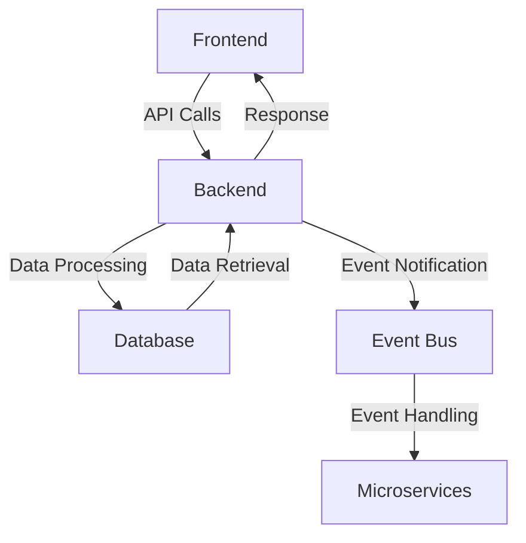
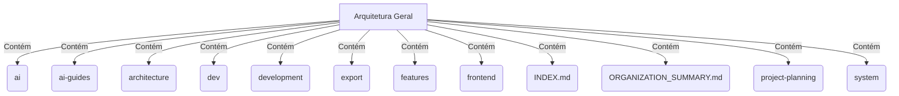
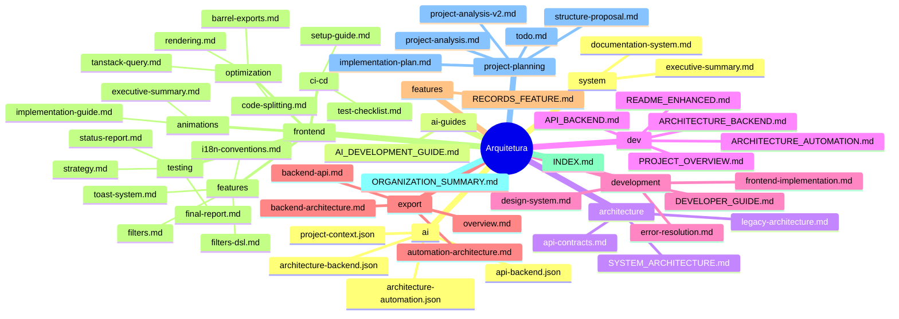

```markdown
# Architecture Documentation - docs

**Generated:** 2025-08-11T14:05:30.451Z  
**Project:** docs  
**Type:** docs  

## Project Structure

```
├── ai (4 files)
│   ├── api-backend.json
│   ├── architecture-automation.json
│   ├── architecture-backend.json
│   └── project-context.json
├── ai-guides (1 file)
│   └── AI_DEVELOPMENT_GUIDE.md
├── architecture (3 files)
│   ├── api-contracts.md
│   ├── legacy-architecture.md
│   └── SYSTEM_ARCHITECTURE.md
├── dev (5 files)
│   ├── API_BACKEND.md
│   ├── ARCHITECTURE_AUTOMATION.md
│   ├── ARCHITECTURE_BACKEND.md
│   ├── PROJECT_OVERVIEW.md
│   └── README_ENHANCED.md
├── development (4 files)
│   ├── design-system.md
│   ├── DEVELOPER_GUIDE.md
│   ├── error-resolution.md
│   └── frontend-implementation.md
├── export (4 files)
│   ├── automation-architecture.md
│   ├── backend-api.md
│   ├── backend-architecture.md
│   └── overview.md
├── features (1 file)
│   └── RECORDS_FEATURE.md
├── frontend (15 files)
│   ├── animations (2 files)
│   │   ├── executive-summary.md
│   │   └── implementation-guide.md
│   ├── ci-cd (2 files)
│   │   ├── setup-guide.md
│   │   └── test-checklist.md
│   ├── features (4 files)
│   │   ├── filters-dsl.md
│   │   ├── filters.md
│   │   ├── i18n-conventions.md
│   │   └── toast-system.md
│   ├── optimization (4 files)
│   │   ├── barrel-exports.md
│   │   ├── code-splitting.md
│   │   ├── rendering.md
│   │   └── tanstack-query.md
│   └── testing (3 files)
│       ├── final-report.md
│       ├── status-report.md
│       └── strategy.md
├── INDEX.md
├── ORGANIZATION_SUMMARY.md
├── project-planning (5 files)
│   ├── implementation-plan.md
│   ├── project-analysis-v2.md
│   ├── project-analysis.md
│   ├── structure-proposal.md
│   └── todo.md
└── system (2 files)
    ├── documentation-system.md
    └── executive-summary.md
```

## Dependencies
- **Frameworks:** [List any frameworks used, e.g., React, Node.js]
- **Libraries:** [List any critical libraries, e.g., Express, Axios]
- **Databases:** [Specify databases, e.g., MongoDB, PostgreSQL]
- **APIs:** [Mention any external APIs integrated]

## Folder Structure Analysis

### `ai`
**Purpose:** Contains configuration files related to AI components.  
**Files:** 4

### `ai-guides`
**Purpose:** Documentation for AI development processes.  
**Files:** 1

### `architecture`
**Purpose:** Documentation outlining the system architecture and API contracts.  
**Files:** 3

### `dev`
**Purpose:** Development documentation including backend architecture and project overview.  
**Files:** 5

### `development`
**Purpose:** Guides for developers, including design systems and error resolution.  
**Files:** 4

### `export`
**Purpose:** Documentation for exporting architectural designs and API specifications.  
**Files:** 4

### `features`
**Purpose:** Documentation for specific features of the system.  
**Files:** 1

### `frontend`
**Purpose:** Contains mixed documentation related to frontend development.  
**Files:** 15

### `project-planning`
**Purpose:** Documentation related to project planning and implementation strategies.  
**Files:** 5

### `system`
**Purpose:** Documentation for the overall system and executive summaries.  
**Files:** 2

## Architectural Patterns
- **Microservices:** The architecture follows a microservices pattern, allowing for independent deployment and scaling of services.
- **Event-Driven Architecture:** Components communicate through events, enhancing decoupling and responsiveness.
- **API-First Approach:** APIs are designed and documented before implementation, ensuring clarity and usability.

## Data Flow Between Components


## Design Decisions
- **Choice of Frameworks:** Selected frameworks based on community support and performance benchmarks.
- **Database Selection:** Chosen for scalability and ease of integration with existing services.
- **API Design:** Emphasized RESTful principles for clarity and ease of use.

## Performance Considerations
- **Caching Strategies:** Implemented caching at multiple layers (e.g., API responses, database queries) to reduce latency.
- **Load Balancing:** Utilized load balancers to distribute traffic evenly across services, enhancing reliability.
- **Monitoring and Logging:** Integrated monitoring tools to track performance metrics and identify bottlenecks.

## Extension Points
- **Plugin Architecture:** The system is designed to allow for plugins, enabling third-party integrations and feature enhancements.
- **API Extensions:** New endpoints can be added without disrupting existing functionality, following versioning practices.

---
*Generated automatically by Documentation Generator*
```
## Diagrams

```mermaid
flowchart TD;
    A[Entrada] -->|Configurações| B(ai);
    A -->|Guias| C(ai-guides);
    A -->|Documentação| D(architecture);
    A -->|Desenvolvimento| E(dev);
    A -->|Desenvolvimento| F(development);
    A -->|Exportação| G(export);
    A -->|Recursos| H(features);
    A -->|Frontend| I(frontend);
    A -->|Planejamento| J(project-planning);
    A -->|Sistema| K(system);
    B -->|Arquivos| B1(api-backend.json);
    B -->|Arquivos| B2(architecture-automation.json);
    B -->|Arquivos| B3(architecture-backend.json);
    B -->|Arquivos| B4(project-context.json);
    C -->|Arquivo| C1(AI_DEVELOPMENT_GUIDE.md);
    D -->|Arquivos| D1(api-contracts.md);
    D -->|Arquivos| D2(legacy-architecture.md);
    D -->|Arquivos| D3(SYSTEM_ARCHITECTURE.md);
    E -->|Arquivos| E1(API_BACKEND.md);
    E -->|Arquivos| E2(ARCHITECTURE_AUTOMATION.md);
    E -->|Arquivos| E3(ARCHITECTURE_BACKEND.md);
    E -->|Arquivos| E4(PROJECT_OVERVIEW.md);
    E -->|Arquivos| E5(README_ENHANCED.md);
    F -->|Arquivos| F1(design-system.md);
    F -->|Arquivos| F2(DEVELOPER_GUIDE.md);
    F -->|Arquivos| F3(error-resolution.md);
    F -->|Arquivos| F4(frontend-implementation.md);
    G -->|Arquivos| G1(automation-architecture.md);
    G -->|Arquivos| G2(backend-api.md);
    G -->|Arquivos| G3(backend-architecture.md);
    G -->|Arquivos| G4(overview.md);
    H -->|Arquivo| H1(RECORDS_FEATURE.md);
    I -->|Subpastas| I1(animations);
    I -->|Subpastas| I2(ci-cd);
    I -->|Subpastas| I3(features);
    I -->|Subpastas| I4(optimization);
    I -->|Subpastas| I5(testing);
    J -->|Arquivos| J1(implementation-plan.md);
    J -->|Arquivos| J2(project-analysis-v2.md);
    J -->|Arquivos| J3(project-analysis.md);
    J -->|Arquivos| J4(structure-proposal.md);
    J -->|Arquivos| J5(todo.md);
    K -->|Arquivos| K1(documentation-system.md);
    K -->|Arquivos| K2(executive-summary.md);
```






